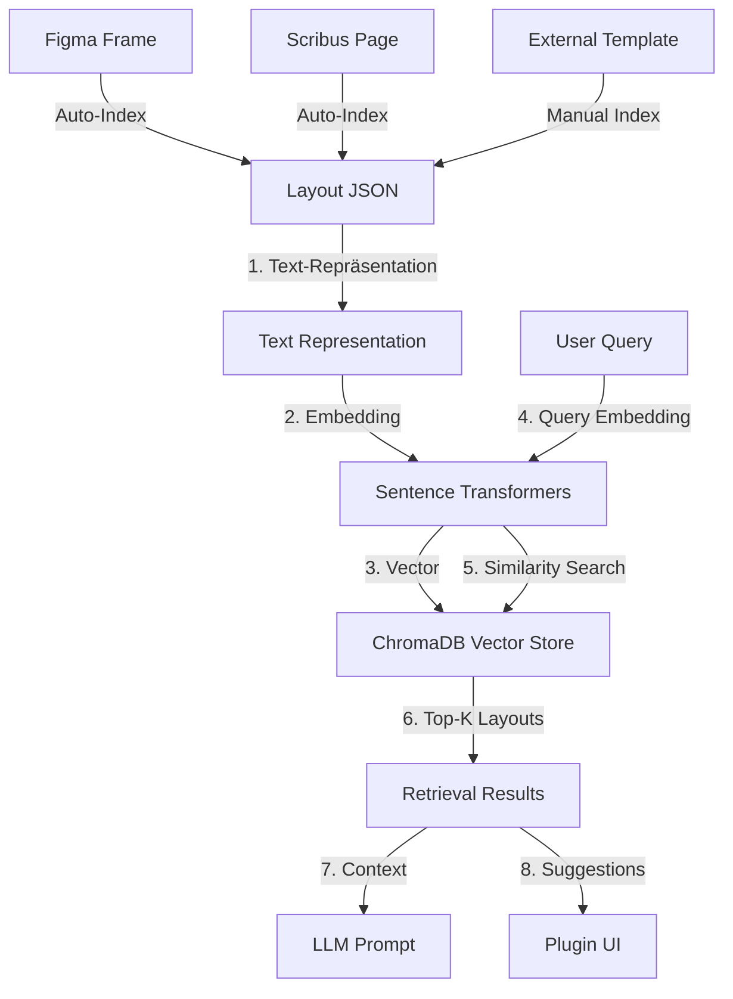

# RAG Integration für Figma & Layout-System (Strategie)

Dieses Dokument überführt die Ideen aus dem lokalen Plan
`C:\Users\Jochen\.cursor\plans\rag_integration_für_figma_&_layout-system_1c36b04d.plan.md`
in eine repo‑taugliche Strategie.

## Ziele (3 Use-Cases)

1. **Ähnliche Layouts finden**
   - „Zeige mir ähnliche Doppelseiten“
   - „Welche Figma-Frames passen zu meinem aktuellen Scribus-Layout?“
2. **LLM-Kontext erweitern**
   - Beim Generieren neuer Layouts dienen ähnliche Layouts als Beispiele/Patterns.
3. **Intelligente Design-Vorschläge**
   - Empfehlungen basierend auf „ähnlichen Magazin-Layouts“.

## Figma AI Integration (Modus 1)

**Ziel:** Figma als *Design-Generator* (Figma AI / Autolayout) nutzen, während RAG als *Content- und Pattern-Geber* dient.

**Wichtig:** Figma AI bietet aktuell keine stabile öffentliche „Generate Design“-API. Deshalb ist **Modus 1** als „Prompt-Pack + Import“ definiert:

1. Backend generiert einen **Figma AI Prompt Pack** (Brief) aus:
   - Layout-JSON (Text/Snippets/Struktur)
   - `project_init.json` (Design-Constraints)
   - optional RAG Retrieval (ähnliche Layout-Patterns, top-k)
2. Der Prompt Pack wird in Figma AI genutzt (manuell oder später via separatem Automation-Agent).
3. Ergebnis-Frames werden danach über die existierenden Endpoints importiert:
   - `POST /api/figma/frames/import` → Layout-JSON zurück in die Scribus-Pipeline

### Endpoint
- `POST /api/figma/ai/brief` erzeugt den Prompt Pack (Mode 1), optional mit RAG-Anreicherung.

### Konfiguration (kanonisch)
Siehe `project_init.json.template`:
- `figma.enabled`
- `figma.mode = 1`
- `figma.file_key`
- `figma.ai.rag_enabled`, `figma.ai.top_k`

## Architektur (High-Level)

## Komponenten

### 1) Vector Store: ChromaDB

- Lokale, persistente Vector DB (ohne Cloud).
- Collection z.B. `layout_collection`.
- Metadata-Vorschlag:
  - `source`: `figma|scribus|external`
  - `file_key`, `frame_id`, `created_at`
- Persistenz: z.B. `data/chroma_db/` (Docker Volume).

### 2) Embeddings: Sentence Transformers

- Standardmodell: `sentence-transformers/all-MiniLM-L6-v2`
- Input: Layout JSON → strukturierter Text (Layout-Beschreibung)
- Output: Embedding-Vektor (z.B. 384-dim).

### 3) Indexing Pipeline

- Auto-Index bei:
  - Figma-Import (`POST /api/figma/frames/import`)
  - Scribus-Export (`POST /api/figma/frames/export`)
- Manual Index für externe Templates (`POST /api/rag/index`).

### 4) Retrieval Pipeline

- Query → Embedding → Similarity Search → Top‑K Ergebnisse
- Optional: Hybrid Search (Vector + Metadata Filter, z.B. nur `source=figma`).

## Umsetzung im Repo (konkret)

1. `packages/rag_integration/` anlegen:
   - `vector_store.py`, `embedder.py`, `indexer.py`, `retriever.py`, `llm_augmenter.py`
2. API-Endpunkte ergänzen:
   - `POST /api/rag/index`
   - `POST /api/rag/search`
3. Plugin-UI:
   - Suche „Ähnliche Layouts“ + Ergebnisliste + „Kontext übernehmen“.
